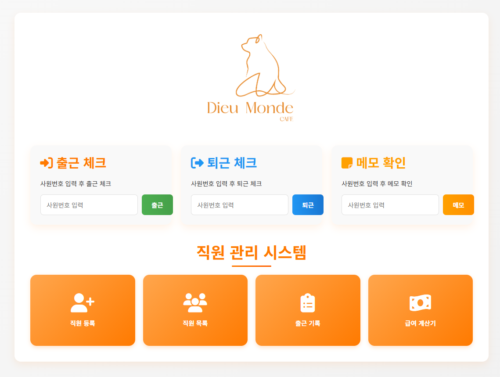
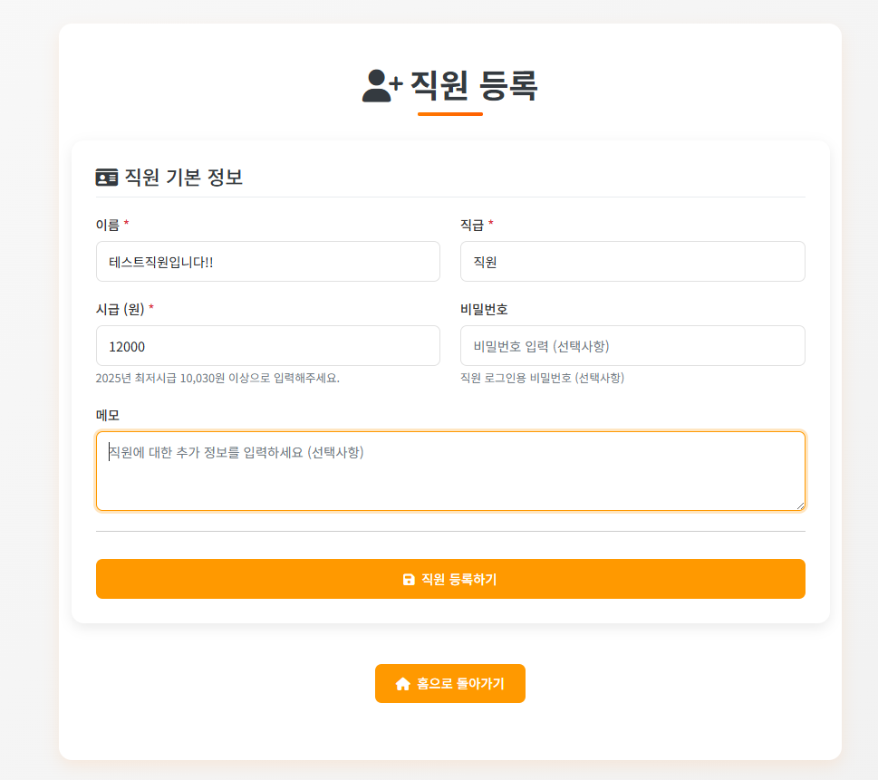
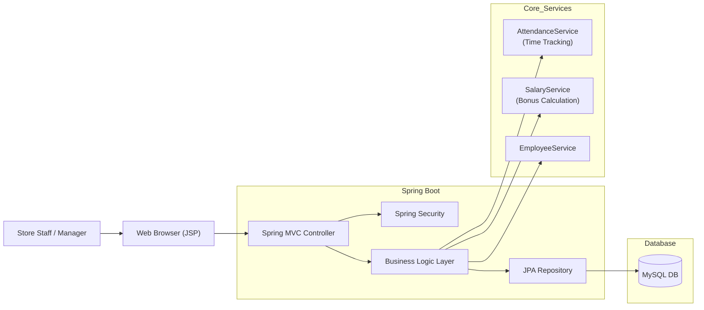

# ☕ CafeHR : 소규모 매장을 위한 올인원 인사 관리 솔루션
> **"복잡한 주휴수당 계산부터 출퇴근 관리까지, 사장님을 위한 가장 간편한 HR 매니저"**

[]()
[]()
[]()
[]()
[]()
[]()

<br>

## 📱 프로젝트 소개
**'CafeHR'**은 카페 및 소규모 매장에서 빈번하게 발생하는 **근태 관리의 번거로움**과 **복잡한 급여 계산(주휴수당)** 문제를 해결하기 위해 개발된 통합 관리 시스템입니다. 
매장 내 태블릿/PC를 키오스크처럼 활용하여 직원은 간편하게 출퇴근을 찍고, 관리자는 대시보드를 통해 모든 현황을 한눈에 파악할 수 있습니다.

*   **타겟 사용자:** 카페 점주, 소규모 매장 관리자
*   **개발 기간:** 2025.01 ~ (진행 중)
*   **주요 특징:** 별도 앱 설치 없이 웹 브라우저만으로 키오스크 모드와 관리자 모드를 모두 지원합니다.

<br>

## 💡 개발 전략 (Development Strategy)
본 프로젝트는 **정확성(Accuracy)**과 **편의성(Usability)**을 최우선 가치로 두었습니다.

*   **Robust Calculation Logic:** 금전과 관련된 **급여 계산**은 1원의 오차도 없어야 합니다. 이를 위해 `BigDecimal`을 전면 도입하여 부동소수점 오차를 원천 차단하고, 근로기준법에 의거한 **주휴수당 자동 산정 알고리즘**을 구현했습니다.
*   **Kiosk-Style UX:** 바쁜 매장 환경을 고려하여, 로그인이 필요 없는 **'사원번호 기반 즉시 체크인'** 시스템을 구축했습니다. 이는 직원의 동선을 최소화하고 사용성을 극대화합니다.

<br>

## ✨ 핵심 기능 (Key Features)

### 1. 🏠 메인 홈 & 키오스크 모드
매장 입구의 태블릿에 띄워두고 사용하는 화면입니다. 직원은 사원번호 입력만으로 **1초 만에 출근/퇴근/메모 확인**이 가능합니다. 불필요한 로그인 세션을 제거하여 접근성을 높였습니다.


*직원용 키오스크 모드와 관리자 메뉴가 통합된 메인 대시보드*

<br>

### 2. 🔐 관리자 보안 & 직원 관리
민감한 직원 정보와 급여 내역은 관리자만 접근할 수 있도록 **Spring Security**로 철저히 보호됩니다. 직원의 시급, 역할, 입사일 등을 체계적으로 관리합니다.

<div style="display: flex; gap: 10px;">
    
    
</div>
*좌: 관리자 인증 화면 / 우: 전체 직원 현황 조회*


*직원 정보 등록 화면 - 시급 및 개인 메모 설정 가능*

<br>

### 3. 📅 스마트 근무 일정 관리
단순 정보 등록을 넘어, 요일별 고정 근무 시간을 설정할 수 있습니다. 이 데이터는 추후 **'예상 급여'**를 산출하는 기초 데이터로 활용됩니다.


*직원 등록 시 근무 스케줄(요일/시간) 동시 설정*


*직원별 상세 스케줄 조회 및 수정 모달*

<br>

### 4. ⏰ 출퇴근 기록 & 실시간 근태 모니터링
직원들의 출퇴근 기록이 실시간으로 서버에 저장됩니다. 관리자는 날짜별/직원별로 기록을 조회하고, 누락된 기록을 직관적인 UI에서 수정할 수 있습니다.


*관리자용 출퇴근 기록 조회 및 수정 페이지*

<br>

### 5. 💰 급여 정산 시스템 (Core Feature)
**CafeHR의 기술력이 집약된 핵심 기능**입니다. 단순 시급 계산을 넘어, **주휴수당** 조건(주 15시간 이상 근무)을 자동으로 판단하여 정확한 급여 명세서를 생성합니다.

#### 5-1. 예상 급여 시뮬레이션
등록된 근무 스케줄을 바탕으로 이번 달 예상 지출 인건비를 미리 계산해 볼 수 있습니다.


*근무 스케줄 기반 예상 급여 시뮬레이션 결과*

#### 5-2. 실제 급여 정산
실제 출퇴근 기록(`Attendance`)을 기반으로 급여를 확정합니다. 지각/조퇴가 반영된 **실 근무시간**을 기준으로 계산됩니다.

.png)
*실제 근무 기록에 기반한 정밀 급여 산출*


*기본급 + 주휴수당이 합산된 최종 급여 명세*

<br>

## 🛠 기술적 고도화 (Technical Deep Dive)

### 🚀 1. 정밀한 주휴수당 계산 알고리즘 (Holiday Bonus Logic)
*   **Problem:** 주휴수당은 '1주 동안 소정근로일수를 개근하고 15시간 이상 근무'해야 발생합니다. 하지만 월(Month)의 시작과 끝이 주(Week)의 중간에 걸쳐 있을 때, **월말/월초의 근무 시간을 어떻게 배분할지**가 복잡한 문제입니다.
*   **Solution:** `SalaryService`에 **주 단위 파싱 로직**을 직접 구현했습니다.
    *   `YearMonth`를 기반으로 해당 월의 모든 날짜를 순회하며 표준 주(월~일) 단위로 그룹핑합니다.
    *   이전 달에서 넘어온 주와 다음 달로 넘어가는 주의 근무 시간을 정확히 분리하여, **해당 월 귀속분**만 계산하거나 필요시 이월시키는 로직을 적용했습니다.
*   **Result:** 법적 기준에 부합하는 정확한 주휴수당 자동 산출 성공.

### ⚡ 2. 동시성 제어 및 데이터 무결성
*   **Problem:** 키오스크 모드 특성상 여러 직원이 빠르게 연속으로 출퇴근 버튼을 누르거나, 네트워크 지연으로 인해 **중복 출근 기록**이 생성될 위험이 있습니다.
*   **Solution:**
    *   **Application Level:** `AttendanceService`에서 `existsByEmployeeAndCheckInBetween` 메서드로 금일 기록 존재 여부를 선제적으로 체크합니다.
    *   **Business Logic:** '출근 상태에서만 퇴근 가능', '퇴근 후 재출근 불가(당일)' 등의 상태 전이(State Transition) 규칙을 엄격하게 적용하여 데이터 오염을 방지했습니다.

### 📊 3. 금융 데이터 정합성 (BigDecimal)
*   **Problem:** 자바의 `double`이나 `float` 타입을 사용할 경우, 시급 계산 시 미세한 소수점 오차가 누적되어 최종 급여액이 달라지는 치명적인 문제가 발생할 수 있습니다.
*   **Solution:** `Employee`의 시급, `Attendance`의 근무 시간, `Salary`의 최종 급여 등 모든 수치 데이터에 **`BigDecimal`** 타입을 적용했습니다. 나눗셈 연산 시 `RoundingMode.HALF_UP`(반올림) 정책을 명시하여 1원 단위까지 정확성을 보장했습니다.

<br>

## 🏗 시스템 아키텍처 (Architecture)



<br>

## 💻 실행 방법 & 계정 정보

### Prerequisites
*   JDK 17
*   MySQL 8.0+

### Installation
1.  **Clone Repository**
    ```bash
    git clone https://github.com/your-repo/cafeHR.git
    ```
2.  **Configure Database** (`src/main/resources/application.properties`)
    ```properties
    spring.datasource.url=jdbc:mysql://localhost:3306/cafeHR_db?createDatabaseIfNotExist=true
    spring.datasource.username=your_username
    spring.datasource.password=your_password
    ```
3.  **Build & Run**
    ```bash
    ./gradlew bootRun
    ```

### 🔐 초기 관리자 계정 (Admin Account)
프로젝트 실행 시, 아래 계정으로 **관리자 기능**에 접근할 수 있습니다.

| ID | Password | Role |
|:---:|:---:|:---:|
| **admin** | **admin** | **ADMIN** |

---

<div align="center">
  <p>Created by <b>Lee Kayoung</b> | Powered by Spring Boot 3 & JSP</p>
</div>
